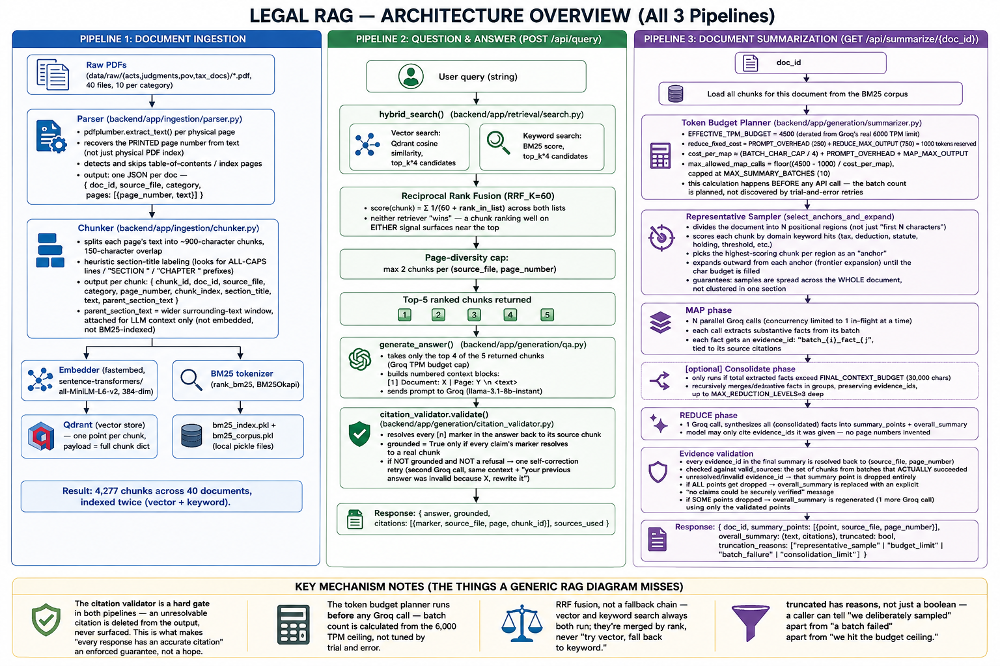

# Architecture Diagram

PDF → Parsing → Hybrid Search → LLM, covering all three real pipelines (ingestion, Q&A,
summarization) with exact function names, file paths, and constants verified against the code.

## What the arrows mean

- **Parsing → Chunking**: the parser's output is the standardized knowledge structure — every
  category (act/judgment/pov/tax_doc) produces the exact same JSON shape, so nothing downstream
  needs to special-case document type.
- **RRF fusion**: neither the vector nor keyword ranker "wins" — a chunk ranking well on *either*
  signal surfaces near the top of the fused list, which is why the diagram shows both retrievers
  feeding one fusion step rather than an if/else choice between them.
- **Citation validation is a hard gate, not a suggestion**: in both the Q&A and summarization
  flows, a citation that cannot be resolved back to a real, retrieved chunk is removed from the
  output rather than trusted — this is what makes "every response includes accurate legal
  citations" an enforced property instead of a hope.
- **The token budget planner runs before any Groq call is made** in the summarization flow — the
  number of MAP batches is a calculated ceiling based on the 6,000 TPM limit, not a number chosen
  by trial and error.
- **`truncated` carries reasons, not just a boolean** — a caller can tell "we deliberately
  sampled" apart from "a batch failed" apart from "we hit the budget ceiling."
