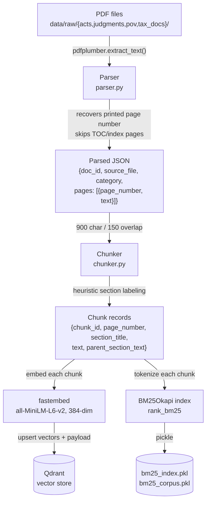
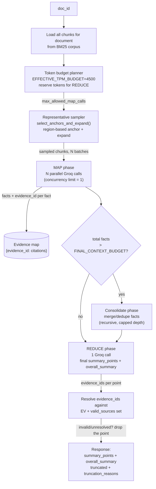

# Architecture Diagram

PDF → Parsing → Hybrid Search → LLM, showing the actual data shapes and decision points at each
stage. Rendered with Mermaid (renders natively on GitHub; also plain text, so it's directly
readable by tooling or another model without an image).

## Ingestion pipeline

## Query-time flow (Q&A)

```mermaid
flowchart LR
    Q["User query"] --> R["hybrid_search()\nsearch.py"]
    R -->|"top_k*4 candidates"| V["Vector search\nQdrant cosine similarity"]
    R -->|"top_k*4 candidates"| K["Keyword search\nBM25 score"]
    V --> F["Reciprocal Rank Fusion\nRRF_K=60"]
    K --> F
    F -->|"page-diversity cap:\nmax 2 chunks per page"| C["Top-5 ranked chunks"]
    C -->|"top 4 chunks, numbered [1]-[4]"| G["generate_answer()\nqa.py"]
    G -->|"prompt + context"| L["Groq\nllama-3.1-8b-instant"]
    L -->|"answer with [n] citations"| V2["citation_validator.validate()"]
    V2 -->|"unresolvable citation? not grounded"| RC{"grounded?"}
    RC -->|"no"| SC["self-correction retry\n(1 extra Groq call)"]
    RC -->|"yes"| OUT["Response:\nanswer + citations\n(source_file, page_number)"]
    SC --> OUT
```

## Summarization flow (Map → Consolidate → Reduce)

## Notes on what the arrows mean

- **Parsing → Chunking**: the parser's output is the standardized knowledge structure — every
  category (act/judgment/pov/tax_doc) produces the exact same JSON shape, so nothing downstream
  needs to special-case document type.
- **RRF fusion**: neither the vector nor keyword ranker "wins" — a chunk ranking well on *either*
  signal surfaces near the top of the fused list, which is why the diagram shows both retrievers
  feeding one fusion step rather than an if/else choice between them.
- **Citation validation is a hard gate, not a suggestion**: in both the Q&A and summarization
  flows, a citation that cannot be resolved back to a real, retrieved chunk is removed from the
  output rather than trusted — this is what makes "every response includes accurate legal
  citations" an enforced property instead of a hope.
- **The token budget planner runs before any Groq call is made** in the summarization flow — the
  number of MAP batches is a calculated ceiling based on the 6,000 TPM limit, not a number chosen
  by trial and error.
